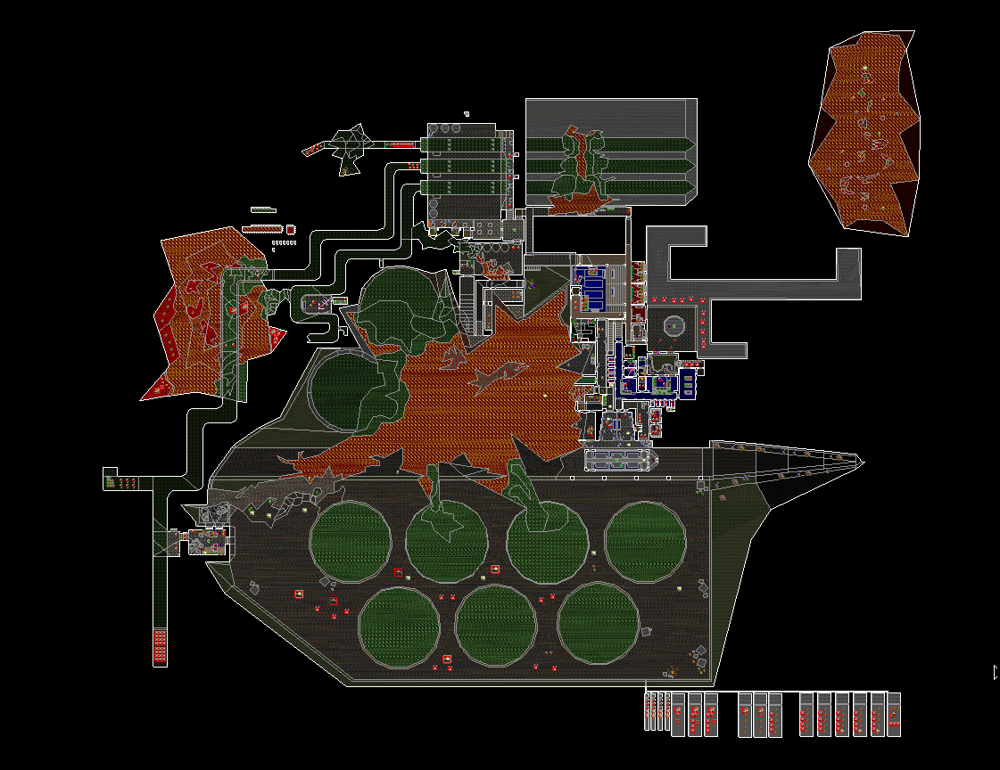

# sneakin's wad

Presently just a single map: base1.wad.

# Requirements

* gzdoom or zdoom
* Doom 2's IWAD, though FreeDoom2 works too.

# Playing

* Download and unzip the archive, or download the Git repository.
* Run Doom with the WAD: `gzdoom -iwad $DOOM2WAD -file maps/base1.wad`

# Updates / contact

* Github [http://github.com/sneakin/sneakins-wad](http://github.com/sneakin/sneakins-wad)
* X / Twitter [@sneakin](https://x.com/sneakin)
